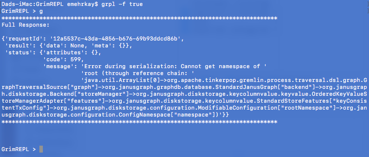

# GrimREPL

Simple REPL for remote [Tinkerpop Gremlin Server](http://tinkerpop.apache.org) connections.


## Requirements

    * Python 3.5 +

## Installation

```
python setup.py install
```

> You may need to do python3.VERSION setup.py install if python 3.5 is not your default python version

## Usage

```
grpl [--uri localhost] [--port 8181] [--full true]
```

Passing the `--full` flag will display the complete output of the response.


