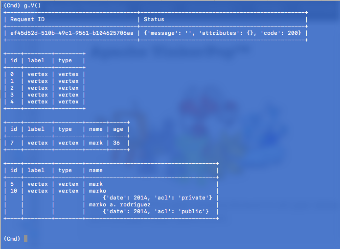

# GrimREPL

Simple REPL for remote [Tinkerpop Gremlin Server](http://tinkerpop.apache.org) connections.



## Requirements

    * Python 3.5 +

## Installation

```
python setup.py install
```

## Usage

```
python gremrepl/repl.py [--uri localhost] [--port 8181] [--full true]
```
